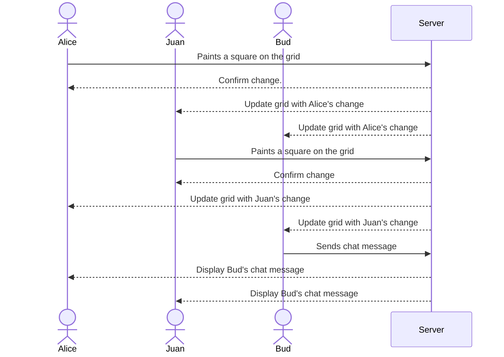

# Lines of Light

This project is a simple grid art creator, where users will be able to draw pictures by filling in the grid squares with selected colors. The application will provide a blank grid canvas, color selection tools, and the ability to save artwork. The app will also allow other users to watch you draw, and include an option for them to comment on your artwork as you draw, making it possible to play games such as pictionary.

## 🚀 Specification Deliverable

For this deliverable I did the following. I checked the box `[x]` and added a description for things I completed.

- [x] Proper use of Markdown
- [x] A concise and compelling elevator pitch
- [x] Description of key features
- [x] Description of how you will use each technology
- [x] One or more rough sketches of your application. Images must be embedded in this file using Markdown image references.

### Elevator pitch

Art has inspired humans for countless generations. From the first cave drawings to today’s modern photography, pictures, paintings, and sculptures have shaped the way we think and feel. **Lines of Light** brings that same creative spirit into a simple, accessible digital tool. Using just a grid and a color palette, anyone can create pixel art, doodles, or even play Pictionary with friends on their phone or computer.

### Design

#### Log-in Page

#### Navigation Page

#### Drawing Page

Here is a sequence diagram that shows how to people would interact with the backend to draw.

### Key features

- Secure login over HTTPS
- Ability to select and view personal and other users art
- Ability to send messages and chat with the artist
- Blank grid canvas and color selection tools
- Ability to send messages to the artist 

### Technologies

I am going to use the required technologies in the following ways.

- **HTML** - Uses correct HTML structure for application. Three HTML pages. One for login, one for selecting a picture, and one for drawing or watching someone draw.
- **CSS** - Application styling that looks good on different screen sizes, uses good whitespace, color choice and contrast.
- **React** - Provides login, display of different pictures to view, drawing tools, display other users art, and use of React for routing and components.
- **Service** - Backend service with endpoints for:
Login
Saving grid data
Loading grid data
- **DB/Login** - MongoDB to store users and their artwork. Secure login system with hashed credentials.
- **WebSocket** - As a user colors the grid, updates are broadcast to all other connected users in real time. A chat feature included for users to comment on an artist work.

## 🚀 AWS deliverable

For this deliverable I did the following. I checked the box `[x]` and added a description for things I completed.

- [x] **Server deployed and accessible with custom domain name** - [My server link](https://linesoflight.click).

## 🚀 HTML deliverable

For this deliverable I did the following. I checked the box `[x]` and added a description for things I completed.

- [x] **HTML pages** - I created 3 HTML pages that represent the ability to login, select art to view, and a page to draw and view another person drawing.
- [x] **Proper HTML element usage** - I did not complete this part of the deliverable.
- [x] **Links** - The login page automatically links to the art selection page. The the art selection buttons link to the drawing page.
- [x] **Text** - Each of the art piece is represented by a textual description. The chat feature also shows possible chat info.
- [x] **Images** - I added a picture as the tab icon; I also added images for featured art place holders.
- [x] **Login placeholder** - Input box and submit button for login.
- [x] **DB data placeholder** - A place holder to find other user's artwork in db.
- [x] **WebSocket placeholder** - A chat box available on drawing page, representing real time chats.

## 🚀 CSS deliverable

For this deliverable I did the following. I checked the box `[x]` and added a description for things I completed.

- [x] **Header, footer, and main content body** - I used a common CSS file format to style these four css pages.
- [x] **Navigation elements** - I used a custom css file type to create my navigation bar.
- [x] **Responsive to window resizing** - Flexbox did the majority of the heavy lifting. I am happy with how it turrned out.
- [x] **Application elements** - I used a lot of display:flex to get things to align correctly.
- [x] **Application text content** - Set all my text to Roboto and it looks nice and clean.
- [x] **Application images** - I kept all sunset immages the same.

## 🚀 React part 1: Routing deliverable

For this deliverable I did the following. I checked the box `[x]` and added a description for things I completed.

- [x] **Bundled using Vite** - I bundled my Lines of Light app using Vite, which provides fast development, HMR, and optimized builds.
- [x] **Components** - I created components for the main app, login page, drawing canvas, quote page,  and gallery page.
- [x] **Router** - I used React Router to navigate between the login page, drawing page, quote page, and gallery page.

## 🚀 React part 2: Reactivity deliverable

For this deliverable I did the following. I checked the box `[x]` and added a description for things I completed.

- [x] **All functionality implemented or mocked out** - The app can now sign in with options to view other art with messages received from a mocked websocket.
- [x] **Hooks** - I used "useNavigate" for route navigation and "useState" to manage the new art name input field.

## 🚀 Service deliverable

For this deliverable I did the following. I checked the box `[x]` and added a description for things I completed.

- [x] **Node.js/Express HTTP service** - I completed this.
- [x] **Static middleware for frontend** - I completed this.
- [x] **Calls to third party endpoints** - I added a third party call which loads an inspirational quote from https://quote.cs260.click
- [x] **Backend service endpoints** - Placeholders for login that stores the current user on the server. 
- [x] **Frontend calls service endpoints** - I did this using the fetch function.
- [x] **Supports registration, login, logout, and restricted endpoint** - Done! Secure endpoints for Watch and Draw.

## 🚀 DB deliverable

For this deliverable I did the following. I checked the box `[x]` and added a description for things I completed.

- [x] **Stores data in MongoDB** - Done! Stores log in credentials and art portfolios. 
- [x] **Stores credentials in MongoDB** - Done! Stores log in credentials and art portfolios.
