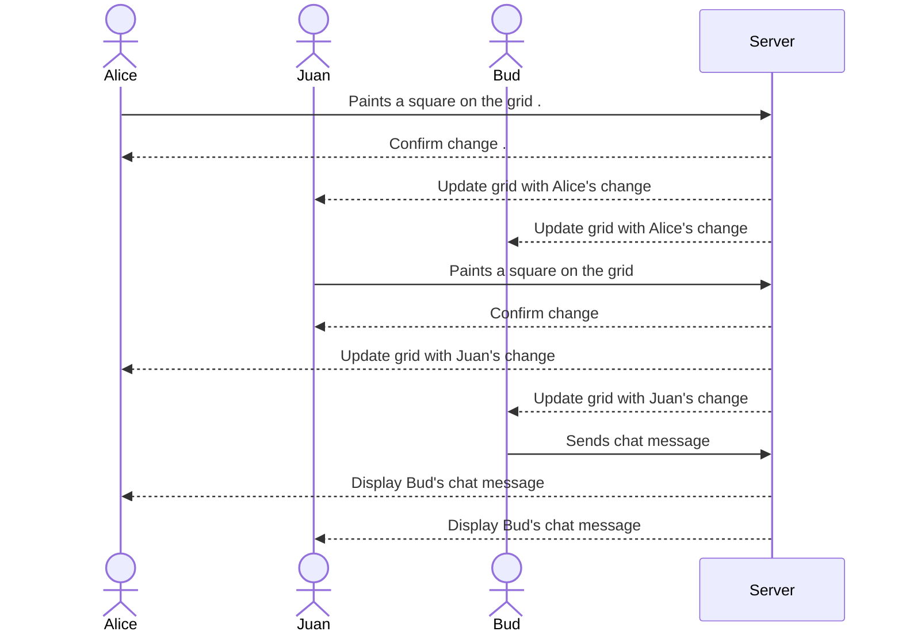

# Lines of Light

[My Notes](notes.md)

This project is a simple grid art creator, where users will be able to draw pictures by filling in the grid squares with selected colors. The application will provide a blank grid canvas, color selection tools, and the ability to save artwork. The app will also allow other users to watch you draw, and include an option for them to comment on your artwork as you draw, making it possible to play games such as pictionary.

### Elevator pitch

Art has inspired humans for countless generations. From the first cave drawings to today’s modern photography, pictures, paintings, and sculptures have shaped the way we think and feel. **Lines of Light** brings that same creative spirit into a simple, accessible digital tool. Using just a grid and a color palette, anyone can create pixel art, doodle, or even play Pictionary with friends on their phone or computer.

### Design

#### Log-in Page

#### Navigation Page

#### Drawing Page

```mermaid
sequenceDiagram
    actor Alice
    actor Juan
    actor Bud
    participant Server

    Alice->>Server: Paints a square on the grid   .
    Server-->>Alice: Confirm change .
    Server-->>Juan:   Update grid with Alice's change
    Server-->>Bud: Update grid with Alice's change

    Juan->>Server: Paints a square on the grid
    Server-->>Juan:  Confirm change
    Server-->>Alice: Update grid with Juan's change
    Server-->>Bud: Update grid with Juan's change

    Bud->>Server: Sends chat message
    Server-->>Alice: Display Bud's chat message
    Server-->>Juan: Display Bud's chat message

```

### Key features

- Secure login over HTTPS
- Ability to select and view personal and other users art
- Ability to send messages and chat with the artist
- Blank grid canvas and color selection tools
- Ability to send messages to the artist 

### Technologies

I am going to use the required technologies in the following ways.

- **HTML** - Uses correct HTML structure for application. Three HTML pages. One for login, one for selecting a picture, and one for drawing or watching someone draw.
- **CSS** - Application styling that looks good on different screen sizes, uses good whitespace, color choice and contrast.
- **React** - Provides login, display of different pictures to view, drawing tools, display other users art, and use of React for routing and components.
- **Service** - Backend service with endpoints for:
Login
Saving grid data
Loading grid data
- **DB/Login** - MongoDB to store users and their artwork. Secure login system with hashed credentials.
- **WebSocket** - As a user colors the grid, updates are broadcast to all other connected users in real time. A chat feature included for users to comment on an artist work.

## 🚀 Specification Deliverable

> [!NOTE]
> Fill in this sections as the submission artifact for this deliverable. You can refer to this [example](https://github.com/webprogramming260/startup-example/blob/main/README.md) for inspiration.

For this deliverable I did the following. I checked the box `[x]` and added a description for things I completed.

- [x] I completed the prerequisites for this deliverable (Git commit requirement)
- [x] Proper use of Markdown
- [x] A concise and compelling elevator pitch
- [x] Description of key features
- [x] Description of how you will use each technology including your 3rd party API and use of WebSocket
- [x] One or more rough sketches of your application. Images must be embedded in this file using Markdown image references.

## 🚀 AWS deliverable

For this deliverable I did the following. I checked the box `[x]` and added a description for things I completed.

- [x] **Rented EC2 server** - I rented a server and set it up with the class template.
- [x] **Leased domain name** - I leased the domain linesoflight.click.
- [x] **Server accessible** from my domain: [https://linesoflight.click](https://linesoflight.click).

## 🚀 HTML deliverable

For this deliverable I did the following. I checked the box `[x]` and added a description for things I completed.

- [x] I completed the prerequisites for this deliverable (Simon deployed, GitHub link, Git commits)
- [x] **HTML pages** - I made 4 HTML pages for navigation, drawing, logging in, and an api quote page.
- [x] **Proper HTML element usage** - I used proper elements.
- [x] **Links** - The login page automatically links to the art selection page. I also added links for navigation.
- [x] **Text** - I added placeholder text for upcoming functionality.
- [x] **3rd party API placeholder** - I made a placeholder for a page that calls a third party api.
- [x] **Images** - I added a free image to my html website quote.
- [x] **Login placeholder** - I created a login page based on the simon login page.
- [x] **DB data placeholder** - I place holder to find other user's artwork in db.
- [x] **WebSocket placeholder** - A chat box available on drawing page, representing real time chats.

## 🚀 CSS deliverable

For this deliverable I did the following. I checked the box `[x]` and added a description for things I completed.

- [x] I completed the prerequisites for this deliverable (Simon deployed, GitHub link, Git commits)
- [x] **Visually appealing colors and layout. No overflowing elements.** -  I used a common CSS file format to style these four css pages.
- [x] **Use of a CSS framework** - I used a little bootstrap for some of this, but I mostly wrote my own.
- [x] **All visual elements styled using CSS** -I styled the body, header, menu, links, main content area, grid cells, color palette, forms, inputs, buttons, chat box, and footer using CSS.
- [x] **Responsive to window resizing using flexbox and/or grid display** - II used flexbox for the body, header/menu, main layout, forms, and chat layout. I also used CSS grid for the main drawing grid and color palette. I added a media query so the main layout changes direction on portrait screens.
- [x] **Use of a imported font** - I Used Times New Roman font on all pages
- [x] **Use of different types of selectors including element, class, ID, and pseudo selectors** -  I completed this by using element selectors like `body`, `header`, `main`, `form`, and `button` etc..

## 🚀 React part 1: Routing deliverable

For this deliverable I did the following. I checked the box `[x]` and added a description for things I completed.

- [x] I completed the prerequisites for this deliverable (Simon deployed, GitHub link, Git commits)
- [x] **Bundled using Vite** - Converted the project to use Vite for React development and bundling.
- [x] **Components** - Created reusable React components to organize the application structure.
- [x] **Router** - Implemented React Router to navigate between different pages/components.

## 🚀 React part 2: Reactivity deliverable

For this deliverable I did the following. I checked the box `[x]` and added a description for things I completed.

- [x] I completed the prerequisites for this deliverable (Simon deployed, GitHub link, Git commits).
- [x] **All functionality implemented or mocked out** - I added a Canvas that can be used to draw, and mocked out a websocket chat feature.
- [x] **Hooks** - I used "useNavigate" for route navigation.

## 🚀 Service deliverable

For this deliverable I did the following. I checked the box `[x]` and added a description for things I completed.

- [x] I completed the prerequisites for this deliverable (Simon deployed, GitHub link, Git commits)
- [x] **Node.js/Express HTTP service** - I used express and node to set up a backend for my web app.
- [x] **Static middleware for frontend** - I did this.
- [x] **Calls to third party endpoints** - I make a call to the cs260 quote endpoint to meet this requirement.
- [x] **Backend service endpoints** - Placeholders for login that stores the current user on the server. 
- [x] **Frontend calls service endpoints** - I did this using the fetch function.
- [x] **Supports registration, login, logout, and restricted endpoint** - I completed this.
- [x] **Uses BCrypt to hash passwords** - I completed this!

## 🚀 DB deliverable

For this deliverable I did the following. I checked the box `[x]` and added a description for things I completed.

- [ ] I completed the prerequisites for this deliverable (Simon deployed, GitHub link, Git commits)
- [ ] **Stores data in MongoDB** - I did not complete this part of the deliverable.
- [ ] **Stores credentials in MongoDB** - I did not complete this part of the deliverable.

## 🚀 WebSocket deliverable

For this deliverable I did the following. I checked the box `[x]` and added a description for things I completed.

- [ ] I completed the prerequisites for this deliverable (Simon deployed, GitHub link, Git commits)
- [ ] **Backend listens for WebSocket connection** - I did not complete this part of the deliverable.
- [ ] **Frontend makes WebSocket connection** - I did not complete this part of the deliverable.
- [ ] **Data sent over WebSocket connection** - I did not complete this part of the deliverable.
- [ ] **WebSocket data displayed** - I did not complete this part of the deliverable.
- [ ] **Application is fully functional** - I did not complete this part of the deliverable.
